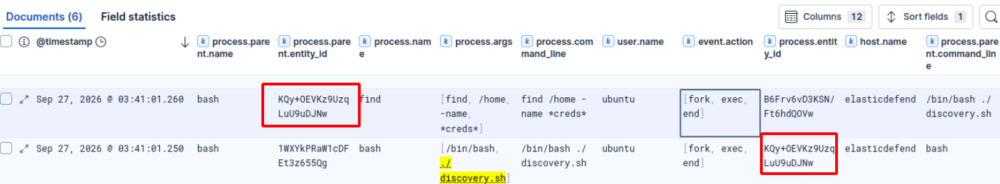
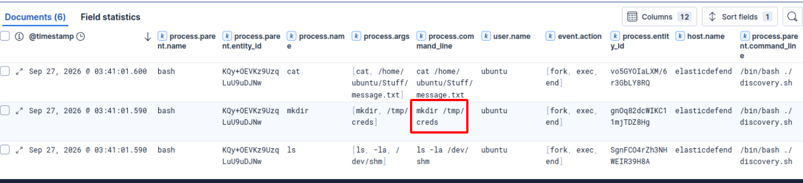
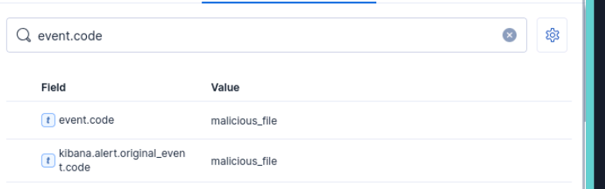
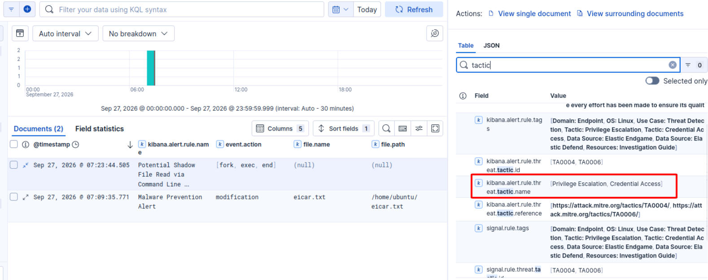
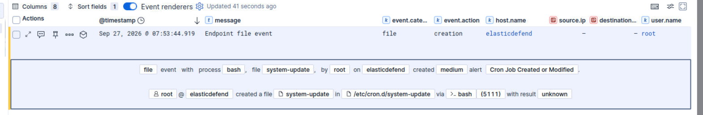

# Elastic: Using Elastic Defend

## Explore Elastic Defend telemetry and alerts to investigate endpoint activity.

Elastic Defend protects endpoints by detecting and preventing malicious activity at the operating system level. Rather than relying solely on known malware signatures, it monitors real-time system behavior. This includes processes, file activity, memory usage, and network connections, so that it can identify both known threats and suspicious techniques used by attackers. This allows it to detect both traditional malware and advanced malicious activity.

## Questions

- What is the process.parent.executable field value for the event you located?

**Answer**: `/usr/bin/bash`

- What is the first command executed by the script? We immediately find the first command executed based on process.parent.entity_id (or easier, based on timestamp)

**Answer**: `find /home -name *creds*`

- What is the name of the directory created in /tmp?

**Answer**: `creds`

- What is the event.risk_score field value?

**Answer**: `73`

- What event.code field value is assigned to the above alert?

**Answer**: `malicious_file`

- What is the first MITRE ATT&CK tactic name associated with the alert?

**Answer**: `Privilege Escalation`

- How many MITRE Tactics are associated with the Cron Job Created or Modified alert?

**Answer**: `3`. These're Persistence (Open a Reverse Shell to connect back every minute and make it a crob job), Privilege Escalation (chmod +x) and Execution.

- Investigate the printf child process using the Analyzer graph and flyout panel. What is the process.executable field value?

**Answer**: `/usr/bin/printf`

- Which IP address and port number were used for the reverse shell attempt?

**Answer**: `10.10.10.100 4444`

- What is the name of the cron job whose permissions were set?

**Answer**: `system-update`

